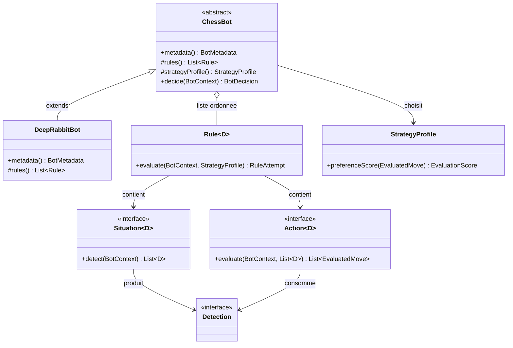
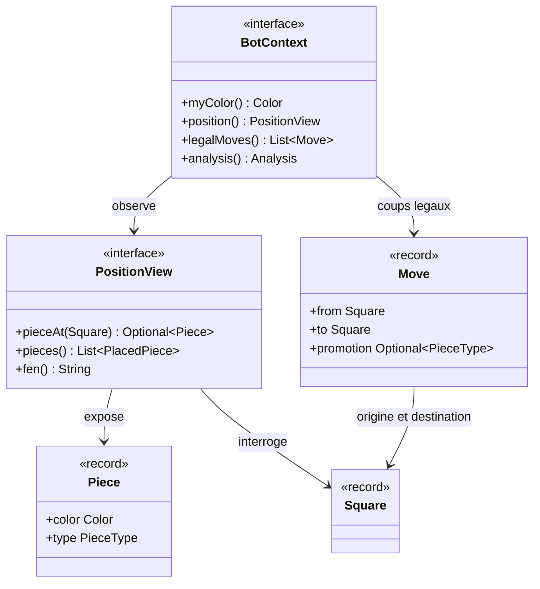
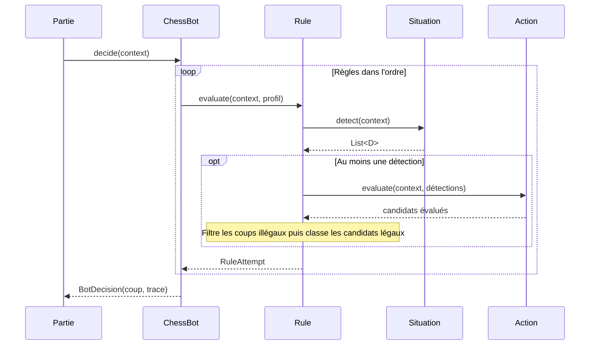

# Comprendre le modèle objet et construire sa stratégie

Ce guide se lit après le [premier lancement](../README.md#vous-êtes-étudiant--commencez-ici). Les diagrammes UML représentent les **classes et contrats réellement présents dans le dépôt** ; ils montrent les relations utiles à un auteur de bot, sans détailler toutes les méthodes du framework.

## 1. Héritage et composition : qui fait quoi ?



**Héritage :** `DeepRabbitBot` *est un* `ChessBot`. Vous redéfinissez `metadata()` et `rules()`, éventuellement `strategyProfile()`. La méthode `decide()` est `final` : elle garde le même déroulement pour tous les bots (**Template Method**). Votre bot n'a pas à recopier cet algorithme.

**Composition :** votre classe *assemble* des `Rule`. Chaque règle contient une `Situation` et une `Action`. On peut donc changer la tactique sans modifier `ChessBot`. `Rule` est une vraie classe générique ; `Situation` et `Action` sont des interfaces fonctionnelles que l'on peut aussi implémenter par des lambdas.

**Polymorphisme :** le tournoi demande une décision à un `ChessBot` sans connaître sa classe concrète. De même, `Rule` invoque `detect()` ou `evaluate()` sans connaître l'implémentation choisie. Comparez [RandomBot](../chess-bots/src/main/java/fr/astroware/chess/bots/baseline/RandomBot.java) et [GreedyBot](../chess-bots/src/main/java/fr/astroware/chess/bots/baseline/GreedyBot.java) : même contrat, comportements différents.

**Génériques :** dans `Rule<D>`, la situation produit une liste de `D` et l'action reçoit **le même type**. Une `Situation<CaptureDetection>` peut ainsi être associée à une `Action<CaptureDetection>` sans conversion hasardeuse. `List<Rule<?>>` signifie que votre bot peut contenir des règles dont les détections ont des types différents ; chaque règle conserve en interne son propre `D`.

## 2. Le modèle d'une position : encapsulation et objets valeur



`BotContext` donne les observations nécessaires à votre bot. `PositionView` n'expose aucun déplacement de pièce : l'état de la partie reste **encapsulé** dans le moteur. Un `Move` décrit une intention (`Move.of("e2", "e4")`), pas une preuve de légalité. Le moteur produit `legalMoves()` et vérifie les candidats avant de jouer. Les `record` (`Piece`, `Square`, `Move`…) représentent des valeurs comparables par leur contenu.

Pour lire une position, commencez par `context.legalMoves()` et `context.position()` ; pour une question tactique, utilisez `context.analysis()`. Ne modifiez pas `chess-core` pour enseigner une nouvelle stratégie à votre bot.

## 3. Ce qui se passe pendant un tour



La boucle **s'arrête à la première règle qui sélectionne un coup légal**. La note de 0 à 10 et le `StrategyProfile` départagent les candidats *de cette règle* ; une règle située plus bas ne peut pas battre une règle antérieure déjà sélectionnée. Si aucune règle ne réussit, `ChessBot` choisit un coup légal aléatoire et l'inscrit dans la trace. Une exception dans une règle produit un `RuleAttempt` en erreur ; la décision peut alors continuer avec la règle suivante.

## 4. Faire évoluer le bot généré : un exemple concret

Le bot généré reconnaît déjà le mat en un, la sortie d'échec et le cas de secours. Insérez **avant** « Secours » une règle qui cible les captures d'une pièce valant au moins 5 selon l'analyse du framework :

```java
import fr.astroware.chess.bot.situation.detection.CaptureDetection;

rule(
    "Capturer une pièce de valeur",
    Situations.captureAvailable()
        .filter(detection -> detection.targetValue() >= 5),
    Actions.playDetectedMove(CaptureDetection::move)
),
```

`filter()` compose une nouvelle `Situation<CaptureDetection>` avec une situation existante. La référence `CaptureDetection::move` permet à l'action de récupérer le coup détecté. Cette action attribue la même note aux coups proposés : si plusieurs captures vous intéressent, leur ordre peut décider du choix. C'est une **première étape**, pas une stratégie complète. Vous pourrez ensuite écrire une `Action<CaptureDetection>` qui attribue des notes différentes et expliquer vos critères dans `EvaluatedMove`.

Conservez « Secours » en dernière position. Si vous le placez avant cette règle, `Situations.always()` fournira toujours un coup et votre nouvelle tactique ne sera jamais examinée. Compilez de nouveau avec `mvn verify`, puis observez un duel `console student-deep-rabbit greedy --isolated`.

## Parcours de travail conseillé

| Étape | Travail dans **votre** package `students` | Concept POO et preuve attendue |
| --- | --- | --- |
| 1 | Lire `RandomBot`, générer son bot et modifier ses métadonnées. | Héritage, redéfinition ; le bot apparaît dans `list`. |
| 2 | Ajouter la règle de capture ci-dessus et déplacer son ordre pour observer la différence. | Composition, priorité des règles ; expliquer les deux comportements dans un test ou une trace. |
| 3 | Créer une `Situation` ou composer `filter()` et `when()` ; décrire précisément ce que contient sa `Detection`. | Interfaces, lambdas, génériques ; tester un cas reconnu et un cas non reconnu. |
| 4 | Produire plusieurs `EvaluatedMove` dans une action personnalisée, avec notes et explications distinctes. | Polymorphisme, encapsulation du calcul ; tester que le coup attendu est sélectionné. |
| 5 | Essayer un profil et un plan, puis jouer contre plusieurs adversaires. | Stratégies interchangeables ; mesurer des résultats et expliquer les limites des tests. |
| 6 | Lancer `mvn verify`, `validate-students`, un duel isolé et une Pull Request. | Tests, contrat d'intégration ; CI verte et PR limitée à votre bot et ses tests. |

Pour tester des situations précises, inspirez-vous des [tests des bots de référence](../chess-bots/src/test/java/fr/astroware/chess/bots/baseline/) et des [tests du SDK](../chess-bot-sdk/src/test/java/fr/astroware/chess/bot/situation/). Le test généré ne vérifie que l'identité : ajoutez au moins un test de **comportement** pour démontrer votre contribution POO.

## Où poursuivre ?

- [Bien démarrer](GETTING_STARTED.md) explique les concepts Java un à un.
- [Guide de soumission](STUDENT_TOURNAMENT_BOT.md) détaille le package imposé, les tests, la validation et la Pull Request.
- [Analyse](ANALYSIS.md), [évaluation](EVALUATION.md), [stratégies](STRATEGIES.md) et [ouvertures](OPENINGS.md) présentent les briques avancées.
- [Architecture](ARCHITECTURE.md) décrit le fonctionnement plus complet du framework.
